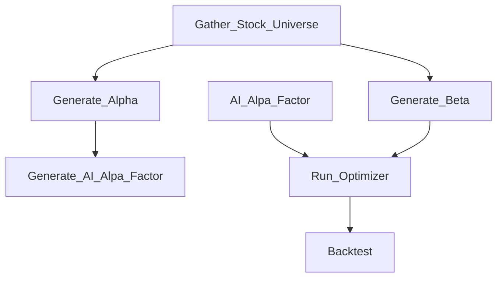

# Silent Viper Investments (SVI) - Trading Tools

# Pourpose
This repository was created from my journey through my lessons in [Udacity's](https://www.udacity.com) AI for Trading Nano Degree Program. It is a culmination of the insights I gather to perform stock analyis using Alhpa and Beta factors.

The project will consist of some python modules and then example notebooks on how to apply these functions. The currnet source data for stock prices are retreived from [Yahoo Finance](https://finance.yahoo.com/).

I have also tied this project to setting buy/sell orders using TD Ameritrade.  To do this you will need is to obtain a software key from [Ameritrade Developer](https://developer.tdameritrade.com/). If you want to analyze your own stock portfolios, and you have an Ameritrade account, then the library has an authentication method and funcitons to pull your data from Ameritrade.

# Flow


If you follow this project, you will notice large swings in the tools provided. This is because along with some sound strategies for performing stock analysis, Udacity provides the underlying theory prior to a final solution, and since I'm building this as I go along, you will see things dissapear because they are replaced by some other higher level concept. 

# Pipleline Limitations
Throught the course Udacity promotes the use of [Quantopian's Zipline](https://github.com/quantopian/zipline) modules. When I started using this library, I had a hard time getting the latest stock prices and was only receiving the sample price histories. I struggled with making it work, even trying to create my own bundles from the Ameritrade data, but decide to abandon the effort an use the [Pandas Datareader](https://pandas-datareader.readthedocs.io/en/latest/). More specifically the [Yahoo Daily Reader](https://pandas-datareader.readthedocs.io/en/latest/readers/yahoo.html).

This forced me to create my own Alpha factors toolsset using Pandas. I think I did a pretty good job of creating a frame work for this, but down the road I will figure out the zipline stuff so that I can work with a larger number of stocks in my analysis. Right now I limit the stocks to the S&P 500 list, which is obtained using the lastest from [Wikipedia's S&P 500 page](https://en.wikipedia.org/wiki/List_of_S%26P_500_companies).

# General Usage (Under Construction)
- Setup:
  - This project uses Ameritrad Developer API and accounts to gather stock and portfolio data
    - You can make necessary changes to use your own source 
  - Get an Ameritrade account [TD Ameritrade](https://www.tdameritrade.com/)
  - Get an Ameritrade developers consumer key  [Ameritrade Developer API](https://developer.tdameritrade.com/)
  - Python 3.8

- Stage 1: Build a stock universe
  - Start with current portfolio stocks using "gather_stock_histories_yahoo" notebook to pull S&P 500 stock histories
  - This notebook also uses the latest sentiment analysis from [Finviz](https://finviz.com/) to reduce the stocks that have poor sentiment
  
  
```new process being planned```

- Gather Alphas/Betas
    - Gather Alpha Data
    - Gather Beta Data
    
- Generate AI Model for AI Alpha Factor (as needed)
    - AI Alpha prediction model
    - Do this periodically to keep the model fresh
    - Use KPIs to determine model's feasability (backtesting, PSI, ...)
    
- Generate optimizer using Alpha/Beta data (as needed)
    - Use an optimizer to select the best stocks based on your needs
    - Use KPIs to determine optimizer's feasability (backtesting)

- Analyze the lastest data to determine new stock holdings
  - Take the lastest Alpha/Beta data
  - Generate AI Alpha
  - Evaluate current data to find new stock holding distribution
  - Make money! 
  - Start over as necessary

# Files

## portfolio_analysis_ml (Jupter Notebook)

This file puts together an entire flow. From authenticating to TD Ameritrace, getting portfolios and downloading price histories. Once most of this is done, a list of Alpha factors are created and processed using standard ML teqniques.

## utils.py

Various utility functions

## project_helper.py

Will be removed. This came with the classwork. 

## ameritrade_functions.py

Functions to interface with Ameritrade. In order to authenticate, I use Selenium through a Chrome driver. You will need to install a compatable Chrome driver (or one that works with your browser) in order to obtain an short term authentication token from Ameritrade. Once you have this, you can look at your own personal portfolios so that you can work them into your optimized portfolio.

## trading_factors.py

Classes and functions to generate Alpha factors and standard quant factors.

## trading_funcitons.py

Some of these will be moved to utils. This was the starting point for organizing the data and generating information like returns. Some of this functionality (like Returns) will be moved to trading_factors.

## portfolio_optimizer.py

This contains a super class and class for using alpha and beta factors to assemble a portfolio mix.

## Various other notebooks.

These notebooks are at this time outdated, but they were used to construct an optimal portfolio using the optimizer.

# Experimental

# sentiment_finvis (Jupyter Notebook)
Using the finvis website to gain sentiment for various stocks. Only look sback 30 days (I think) and not all the stocks I track can be found there. Eventually we will pull 10K documents (for thos available) to get some idea of sentiment for a ticker. What I found there as well, since some of my stocks are in other countries, that not all of them have these documents.

# table_from_html (Jupyter Notebook)
Another class document used to pull data from web sites

# ameritrade_api (Jupyter Notebook)
A notebook I used to experiment with the ameritrade_functions.py module.
