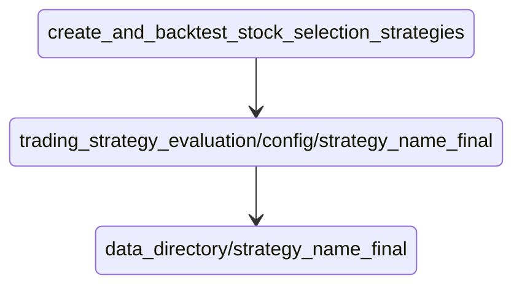
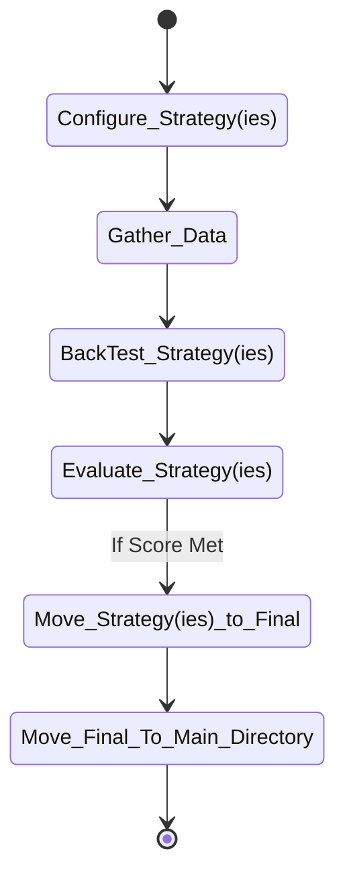
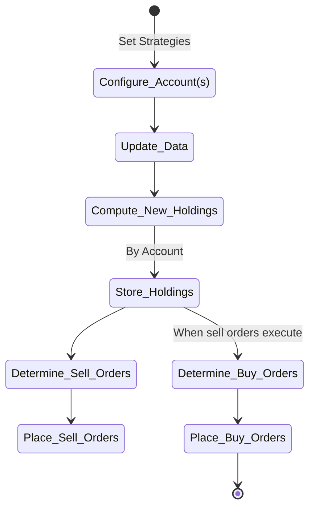

# Silent Viper Investments (SVI) - Trading Tools

## Purpose
This repository was created from my journey through my lessons in [Udacity's](https://www.udacity.com) AI for Trading Nano Degree Program. It is a culmination of the insights I gather to perform stock analysis using Alpha and Beta factors.

The project will consist of some python modules and then example notebooks on how to apply these functions. The current source data for stock prices are retrieved from [Yahoo Finance](https://finance.yahoo.com/).

I have also tied this project to setting buy/sell orders using TD Ameritrade.  To do this you will need is to obtain a software key from [Ameritrade Developer](https://developer.tdameritrade.com/). If you want to analyze your own stock portfolios, and you have an Ameritrade account, then the library has an authentication method and funcitons to pull your data from Ameritrade.

If you follow this project, you will notice large swings in the tools provided. This is because along with some sound strategies for performing stock analysis, Udacity provides the underlying theory prior to a final solution, and since I'm building this as I go along, you will see things disappear because they are replaced by some other higher level concept. 

## Pipeline Limitations
Through the course Udacity promotes the use of [Quantopian's Zipline](https://github.com/quantopian/zipline) modules. When I started using this library, I had a hard time getting the latest stock prices and was only receiving the sample price histories. I struggled with making it work, even trying to create my own bundles from the Ameritrade data, but decide to abandon the effort an use the [Pandas Datareader](https://pandas-datareader.readthedocs.io/en/latest/). More specifically the [Yahoo Daily Reader](https://pandas-datareader.readthedocs.io/en/latest/readers/yahoo.html).

This forced me to create my own Alpha factors toolset using Pandas. I think I did a pretty good job of creating a frame work for this, but down the road I will figure out the zipline stuff so that I can work with a larger number of stocks in my analysis. Right now I limit the stocks to the S&P 500 list, which is obtained using the lastest from [Wikipedia's S&P 500 page](https://en.wikipedia.org/wiki/List_of_S%26P_500_companies).

## General Usage (Under Construction)
- Setup:
  - This project uses Ameritrade Developer API and accounts to gather stock and portfolio data
    - You can make necessary changes to use your own source 
  - Get an Ameritrade account [TD Ameritrade](https://www.tdameritrade.com/)
  - Get an Ameritrade developers consumer key  [Ameritrade Developer API](https://developer.tdameritrade.com/)
  - Python 3.9
  - Python modules are listed in the requirements.txt file
  - trading_strategy_evaluation/create_and_backtest_stock_selection_strategies.py To Create Trading Strategies
  - compute_new_holdings.py To Determine holdings by account based on strategy
  - portfolio_holdings_adjustment.py To place buy/sell orders based on new holdings
    - Existing stocks identified in new holdings are not changed, existing stocks are removed and holdings are adjusted
  - liquidate_short_term_assets.py To liquidate all short-term assets 

### Overview

  
### Create and Test a Trading Strategy

### Use Strategy(ies) to adjust portfolio
